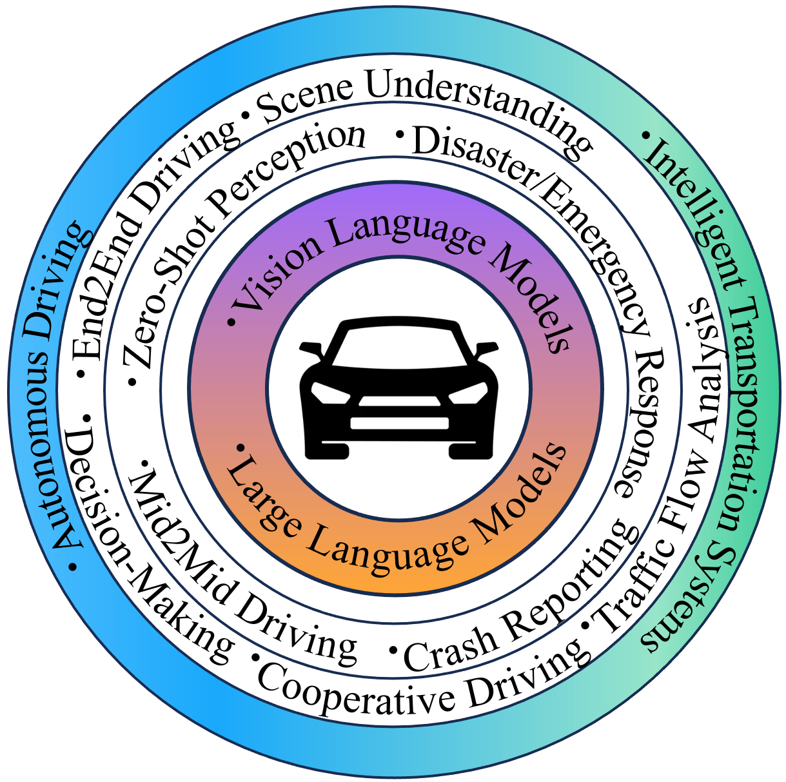
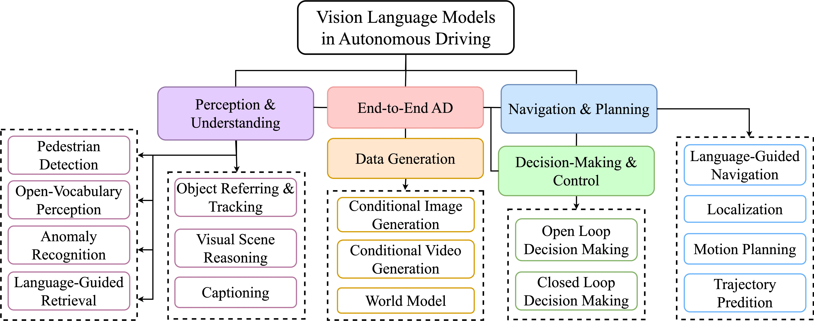

# Vision Language Models in Autonomous Driving: A Survey and Outlook :oncoming_automobile:
<div align="center">
<a href="https://ieeexplore.ieee.org/document/10531702"></a>
<a href="https://github.com/ge25nab/Awesome-VLMs-in-Autonomous-Driving-and-ITS/stargazers"></a>
<a href="https://github.com/ge25nab/Awesome-VLMs-in-Autonomous-Driving-and-ITS/network/members"></a>
<a href="https://github.com/abhisheknaiidu/awesome-github-profile-readm/pulls"></a>
<a href="https://github.com/ge25nab/Awesome-VLMs-in-Autonomous-Driving-and-ITS/issues"></a>
<a href="https://github.com/ge25nab/Awesome-VLMs-in-Autonomous-Driving-and-ITS/blob/main/LICENSE"></a>
</div>

This repository collects research papers on __Vision Language Models in Autonomous Driving: A Survey and Outlook__. The repo maintained by [TUM-AIR](https://www.ce.cit.tum.de/air/home/) will be continuously updated to track the latest work in the community. 


**Keywords: Vision Language Model, Large Language Model, Autonomous Driving, Intelligent Vehicle,
Conditional Data Generation, Decision Making, Language-guided Navigation, End-to-End Autonomous Driving**
<p align="center">

</p>

## :fire: Update
- [17.May.2024] Our paper has been accepted by [IEEE Transactions on Intelligent Vehicles](https://ieeexplore.ieee.org/document/10531702/keywords#keywords).
- [22.Oct.2023] ArXiv Version: Vision Language Models in Autonomous Driving and Intelligent Transportation Systems 

## 🤝 &nbsp; Citation
Please visit [Vision Language Models in Autonomous Driving: A Survey and Outlook](https://ieeexplore.ieee.org/document/10531702) for more details and comprehensive information. If you find our paper and repo helpful, please consider citing it as follows:

```BibTeX
@ARTICLE{10531702,
  author={Zhou, Xingcheng and Liu, Mingyu and Yurtsever, Ekim and Zagar, Bare Luka and Zimmer, Walter and Cao, Hu and Knoll, Alois C.},
  journal={IEEE Transactions on Intelligent Vehicles}, 
  title={Vision Language Models in Autonomous Driving: A Survey and Outlook}, 
  year={2024},
  pages={1-20},
  keywords={Autonomous vehicles;Task analysis;Planning;SData models;Surveys;Computational modeling;Visualization;Vision Language Model;Large Language Model;Autonomous Driving;Intelligent Vehicle;Conditional Data Generation;Decision Making;Language-guided Navigation;End-to-End Autonomous Driving},
  doi={10.1109/TIV.2024.3402136}}

```

## :page_with_curl: Introduction
The applications of **Vision-Language Models (VLMs)** in the fields of **Autonomous Driving (AD)** and **Intelligent Transportation Systems (ITS)** have attracted widespread attention due to their outstanding performance and the ability to leverage **Large Language Models (LLMs)**. By integrating
language data, the vehicles, and transportation systems are able to deeply understand real-world environments, improving driving safety and efficiency

<p align="center">

</p>

## 🌟 Large VLMs in Autonomous Driving

### Perception and Understanding
| Method                                                                                                                                                                                                                                                                                                                                                                                                                                                                                                                                                                                                                                                                                                                       | Year | Task                                                | Code Link                                                        |                                               
|:-----------------------------------------------------------------------------------------------------------------------------------------------------------------------------------------------------------------------------------------------------------------------------------------------------------------------------------------------------------------------------------------------------------------------------------------------------------------------------------------------------------------------------------------------------------------------------------------------------------------------------------------------------------------------------------------------------------------------------|------|-----------------------------------------------------|------------------------------------------------------------------| 
| [The Traffic Scene Understanding and Prediction Based on Image Captioning](https://ieeexplore.ieee.org/document/9306804)                                                                                                                                                                                                                                                                                                                                                                                                                                                                                                                                                                                                     | 2020 | Image Captioning                                    |                                                                  | 
| [VLPD: Context-Aware Pedestrian Detection via Vision-Language Semantic Self-Supervision](https://arxiv.org/pdf/2304.03135.pdf)                                                                                                                                                                                                                                                                                                                                                                                                                                                                                                                                                                                               | 2023 | Pedestrian Detection                                | [Github](https://github.com/lmy98129/VLPD)                       | 
| [Unsupervised Multi-view Pedestrian Detection](https://arxiv.org/pdf/2305.12457.pdf)                                                                                                                                                                                                                                                                                                                                                                                                                                                                                                                                                                                                                                         | 2023 | Pedestrian Detection                                |                                                                  | 
| [Language-Guided 3D Object Detection in Point Cloud for Autonomous Driving](https://arxiv.org/pdf/2305.15765.pdf)                                                                                                                                                                                                                                                                                                                                                                                                                                                                                                                                                                                                            | 2023 | Single Object Referring                             |                                                                  | 
| [Referring Multi-Object Tracking](https://arxiv.org/pdf/2303.03366.pdf)                                                                                                                                                                                                                                                                                                                                                                                                                                                                                                                                                                                                                                                      | 2023 | Multiple Objects Referring and Tracking             | [Github](https://github.com/wudongming97/rmot)                   | 
| [Language Prompt for Autonomous Driving](https://arxiv.org/pdf/2309.04379v1.pdf)                                                                                                                                                                                                                                                                                                                                                                                                                                                                                                                                                                                                                                             | 2023 | Multiple Objects Referring and Tracking             | [Github](https://github.com/wudongming97/prompt4driving)         | 
| [OpenScene: 3D Scene Understanding with Open Vocabularies](https://arxiv.org/pdf/2211.15654.pdf)                                                                                                                                                                                                                                                                                                                                                                                                                                                                                                                                                                                                                             | 2023 | Open-Voc 3D Semantic Segmentation                   | [Github](https://github.com/pengsongyou/openscene)               |
| [CLIP2Scene: Towards Label-efficient 3D Scene Understanding by CLIP](https://arxiv.org/pdf/2301.04926.pdf)                                                                                                                                                                                                                                                                                                                                                                                                                                                                                                                                                                                                                   | 2023 | Open-Voc 3D Semantic Segmentation                   | [Github](https://github.com/runnanchen/CLIP2Scene)               | 
| [Unsupervised 3D Perception with 2D Vision-Language Distillation for Autonomous Driving](https://openaccess.thecvf.com/content/ICCV2023/papers/Najibi_Unsupervised_3D_Perception_with_2D_Vision-Language_Distillation_for_Autonomous_Driving_ICCV_2023_paper.pdf)                                                                                                                                                                                                                                                                                                                                                                                                                                                            | 2023 | Open-Voc 3D Object Detection and Tracking           |                                                                  | 
| [Zelda: Video Analytics using Vision-Language Models](https://arxiv.org/pdf/2305.03785.pdf#:~:text=We%20present%20Zelda%3A%20a%20video,and%20identify%20low%2Dquality%20frames.)                                                                                                                                                                                                                                                                                                                                                                                                                                                                                                                                             | 2023 | Language-guided Video Retrieval                     |                                                                  | 
| [NuScenes-QA: A Multi-modal Visual Question Answering Benchmark for Autonomous Driving Scenario](https://arxiv.org/pdf/2305.14836.pdf)                                                                                                                                                                                                                                                                                                                                                                                                                                                                                                                                                                                       | 2023 | Visual Question Answering                           | [Github](https://github.com/qiantianwen/NuScenes-QA)             | 
| [Talk2BEV: Language-Enhanced Bird's Eye View (BEV) Maps](https://arxiv.org/abs/2310.02251)                                                                                                                                                                                                                                                                                                                                                                                                                                                                                                                                                                                                                                   | 2023 | Visual Spatial Reasoning, Open-loop Decision making | [Github](https://github.com/llmbev/talk2bev)                     | 
| [Semantic Anomaly Detection with Large Language Models](https://arxiv.org/pdf/2305.11307.pdf)                                                                                                                                                                                                                                                                                                                                                                                                                                                                                                                                                                                                                                | 2023 | Semantic Anomaly Detection                          |                                                                  |
| [Embodied Understanding of Driving Scenarios](https://arxiv.org/pdf/2403.04593)       | 2024 | Visual Spatial Reasoning  |  [Github](https://github.com/OpenDriveLab/ELM) | 
| [SimpleLLM4AD: An End-to-End Vision-Language Model with Graph Visual Question Answering for Autonomous Driving](https://arxiv.org/pdf/2407.21293)       | 2024 | Visual Spatial Reasoning  |  | 


### Navigation and Planning
| Method                                                                                                                                                                       | Year | Task                                                     | Code Link                                              |                                               
|:-----------------------------------------------------------------------------------------------------------------------------------------------------------------------------|------|----------------------------------------------------------|--------------------------------------------------------| 
| [Talk to the vehicle: Language conditioned autonomous navigation of self driving car](https://ieeexplore.ieee.org/document/8967929)                                          | 2019 | Language-Guided Navigation                               |                                                        | 
| [Ground then Navigate: Language-guided Navigation in Dynamic Scenes](https://arxiv.org/abs/2209.11972)                                                                       | 2022 | Language-Guided Navigation                               |                                                        |
| [ALT-Pilot: Autonomous navigation with Language augmented Topometric maps](https://arxiv.org/pdf/2310.02324.pdf)                                                             | 2023 | Vision-Language Localization, Language-Guided Navigation | [Page](https://navigate-anywhere.github.io/ALT-Pilot/) |
| [GPT-Driver: Learning to Drive with GPT](https://arxiv.org/pdf/2310.01415.pdf)                                                                                               | 2023 | Motion Planing                                           | [Github](https://github.com/PointsCoder/GPT-Driver)    |
| [Can you text what is happening? Integrating pre-trained language encoders into trajectory prediction models for autonomous driving](https://arxiv.org/pdf/2309.05282.pdf)   | 2023 | Trajectory Prediction                                    |                                                        |
| [DRIVEVLM: The Convergence of Autonomous Driving and Large Vision-Language Models](https://arxiv.org/pdf/2402.12289.pdf)   | 2024 | Trajectory Prediction, Motion Planning                                    |                 [Github](https://tsinghua-mars-lab.github.io/DriveVLM/)                                       |
| [Text-to-Drive: Diverse Driving Behavior Synthesis via Large Language Models](https://arxiv.org/pdf/2406.04300)   | 2024 | Trajectory Prediction, Motion Planning                                    |                 [Github](https://text-to-drive.github.io/)                                       |


### Decision-Making and Control
| Method                                                                                                                                                                                                                                                                | Year | Task                                        | Code Link                                              |                                               
|:----------------------------------------------------------------------------------------------------------------------------------------------------------------------------------------------------------------------------------------------------------------------|------|---------------------------------------------|--------------------------------------------------------| 
| [Advisable Learning for Self-driving Vehicles by Internalizing Observation-to-Action Rules](https://openaccess.thecvf.com/content_CVPR_2020/papers/Kim_Advisable_Learning_for_Self-Driving_Vehicles_by_Internalizing_Observation-to-Action_Rules_CVPR_2020_paper.pdf) | 2020 | Open-loop Decision-Making                   |                                                        |
| [LanguageMPC: Large Language Models as Decision Makers for Autonomous Driving](https://arxiv.org/pdf/2310.03026.pdf)                                                                                                                                                  | 2023 | Open-loop Decision-Making                   |                                                        |
| [Receive, Reason, and React: Drive as You Say with Large Language Models in Autonomous Vehicles](https://arxiv.org/pdf/2310.08034v1.pdf)                                                                                                                              | 2023 | Open-loop Decision-Making, Motion Planing   |                                                        |
| [Driving with LLMs: Fusing Object-Level Vector Modality for Explainable Autonomous Driving](https://arxiv.org/abs/2310.01957)                                                                                                                                         | 2023 | Open-loop Control, Visual Spatial Reasoning | [Github](https://github.com/wayveai/Driving-with-LLMs) |
| [DiLu: A Knowledge-Driven Approach to Autonomous Driving with Large Language Models](https://arxiv.org/pdf/2309.16292.pdf)                                                                                                                                            | 2023 | Closed-loop Decision-Making                 |                                                        |
| [SurrealDriver: Designing Generative Driver Agent Simulation Framework in Urban Contexts based on Large Language Model](https://arxiv.org/pdf/2309.13193.pdf)                                                                                                         | 2023 | Closed-loop Decision-Making                 |                                                        |
| [Drive Like a Human: Rethinking Autonomous Driving with Large Language Models](https://arxiv.org/pdf/2307.07162.pdf)                                                                                                                                                  | 2024 | Closed-loop Decision-Making                 | [Github](https://github.com/PJLab-ADG/DriveLikeAHuman) |


### End-to-End Autonomous Driving
| Method                                                                                                                                                             | Year | Task                                                | Code Link                                                                               |                                               
|:-------------------------------------------------------------------------------------------------------------------------------------------------------------------|------|-----------------------------------------------------|-----------------------------------------------------------------------------------------| 
| [DriveGPT4: Interpretable End-to-end Autonomous Driving via Large Language Model](https://arxiv.org/pdf/2310.01412.pdf)                                            | 2023 | Open-loop Control, Visual Question Answering        | []()                                                                                    |
| [ADAPT: Action-aware Driving Caption Transformer](https://arxiv.org/pdf/2302.00673.pdf)                                                                            | 2023 | Open-loop Decision-Making, Visual Spatial Reasoning | [Github](https://github.com/jxbbb/ADAPT#adapt-action-aware-driving-caption-transformer) |
| [DriveMLM: Aligning Multi-Modal Large Language Models with Behavioral Planning States for Autonomous Driving](https://arxiv.org/pdf/2312.09245.pdf)       | 2023 | Closed-loop Control  | [Github](https://github.com/OpenGVLab/DriveMLM) |
| [VLP: Vision Language Planning for Autonomous Driving](https://arxiv.org/pdf/2401.05577.pdf)       | 2023 | Open-loop Control, 3D Object Detection and Tracking  |  |
| [CoVLA: Comprehensive Vision-Language-Action Dataset for Autonomous Driving](https://arxiv.org/pdf/2408.10845)       | 2024 | Open-loop Control, Visual Spatial Reasoning  |  |
| [Hint-AD: Holistically Aligned Interpretability in End-to-End Autonomous Driving](https://arxiv.org/pdf/2409.06702)       | 2024 | Open-loop Control, Visual Spatial Reasoning  |  |

### Data Generation
| Method                                                                                                                                                                                                                              | Year | Task                                    | Code Link                                                     |                                               
|:------------------------------------------------------------------------------------------------------------------------------------------------------------------------------------------------------------------------------------|------|-----------------------------------------|---------------------------------------------------------------| 
| [DriveGAN: Towards a Controllable High-Quality Neural Simulation](https://arxiv.org/pdf/2104.15060.pdf)                                                                                                                             | 2021 | Conditional Video Generation            | [Page](https://research.nvidia.com/labs/toronto-ai/DriveGAN/) |
| [GAIA-1: A Generative World Model for Autonomous Driving](https://arxiv.org/pdf/2309.17080.pdf)                                                                                                                                     | 2023 | Conditional Video Generation            | [Page](https://wayve.ai/thinking/introducing-gaia1/)          |
| [DriveDreamer: Towards Real-world-driven World Models for Autonomous Driving](https://arxiv.org/pdf/2309.09777.pdf)                                                                                                                 | 2023 | Conditional Video Generation            | [Github](https://github.com/JeffWang987/DriveDreamer)         |
| [DrivingDiffusion: Layout-Guided multi-view driving scene video generation with latent diffusion model](https://arxiv.org/pdf/2310.07771.pdf)                                                                                       | 2023 | Conditional Multi-view Video Generation | [Github](https://github.com/shalfun/DrivingDiffusion)         |
| [BEVControl: Accurately Controlling Street-view Elements with Multi-perspective Consistency via BEV Sketch Layout](https://arxiv.org/pdf/2308.01661.pdf)                                                                            | 2023 | Conditional Image Generation            |                                                               |
| [DriveDreamer-2: LLM-Enhanced World Models for Diverse Driving Video Generation](https://arxiv.org/abs/2403.06845)                                                                                                                 | 2023 | Conditional Video Generation            | [Github](https://drivedreamer2.github.io/)         |
| [DriveGenVLM: Real-world Video Generation for Vision Language Model-based Autonomous Driving](https://arxiv.org/pdf/2408.16647)                                                                                                                 | 2024 | Conditional Video Generation            |         |


## 🌟 Large VLMs in Intelligent Transportation Systems

### ITS Perception and Understanding
| Method                                                                                                                                                                                                                                                                                            | Year | Task                                        | Code Link                                                      |                                               
|:--------------------------------------------------------------------------------------------------------------------------------------------------------------------------------------------------------------------------------------------------------------------------------------------------|------|---------------------------------------------|----------------------------------------------------------------| 
| [A Multi-granularity Retrieval System for Natural Language-based Vehicle Retrieval](https://openaccess.thecvf.com/content/CVPR2022W/AICity/papers/Zhang_A_Multi-Granularity_Retrieval_System_for_Natural_Language-Based_Vehicle_Retrieval_CVPRW_2022_paper.pdf)                                   | 2022 | Language-Guided Vehicle Retrieval           | [Page](https://www.aicitychallenge.org/2023-challenge-tracks/) |
| [Tracked-Vehicle Retrieval by Natural Language Descriptions With Multi-Contextual Adaptive Knowledge](https://openaccess.thecvf.com/content/CVPR2023W/AICity/papers/Le_Tracked-Vehicle_Retrieval_by_Natural_Language_Descriptions_With_Multi-Contextual_Adaptive_Knowledge_CVPRW_2023_paper.pdf)  | 2023 | Language-Guided Vehicle Retrieval           | [Page](https://www.aicitychallenge.org/2023-challenge-tracks/) |
| [A Unified Multi-modal Structure for Retrieving Tracked Vehicles through Natural Language Descriptions](https://openaccess.thecvf.com/content/CVPR2023W/AICity/papers/Xie_A_Unified_Multi-Modal_Structure_for_Retrieving_Tracked_Vehicles_Through_Natural_CVPRW_2023_paper.pdf)                   | 2023 | Language-Guided Vehicle Retrieval           | [Page](https://www.aicitychallenge.org/2023-challenge-tracks/) |
| [Traffic-Domain Video Question Answering with Automatic Captioning](https://arxiv.org/pdf/2307.09636.pdf)                                                                                                                                                                                         | 2023 | Image Captioning, Visual Question Answering |                                                                |
| [Causality-aware Visual Scene Discovery for Cross-Modal Question Reasoning](https://arxiv.org/pdf/2304.08083.pdf)                                                                                                                                                                                 | 2023 | Visual Question Answering                   |                                                                |
| [Tem-adapter: Adapting Image-Text Pretraining for Video Question Answer](https://arxiv.org/pdf/2308.08414.pdf)                                                                                                                                                                                    | 2023 | Visual Question Answering                   | [Github](https://github.com/XLiu443/Tem-adapter)               |
| [Delving into CLIP latent space for Video Anomaly Recognition](https://arxiv.org/pdf/2310.02835.pdf)                                                                                                                                                                                              | 2023 | Video Anomaly Recognition                   | [Github](https://github.com/luca-zanella-dvl/AnomalyCLIP)      |


### ITS Management System
| Method                                                                                                                                                                                                                                                                                                                                                                                        | Year | Task                   | Code Link |                                               
|:----------------------------------------------------------------------------------------------------------------------------------------------------------------------------------------------------------------------------------------------------------------------------------------------------------------------------------------------------------------------------------------------|------|------------------------|-----------|
| [LLM Powered Sim-to-real Transfer for Traffic Signal Control](https://arxiv.org/pdf/2308.14284.pdf)                                                                                                                                                                                                                                                                                           | 2023 | Traffic Signal Control |           |


## 🌟 Dataset

### Autonomous Driving Datasets
| Dataset                                                                                                                                                                                                                                                                                           | Year | Task                       | Data Link                                             |                                               
|:--------------------------------------------------------------------------------------------------------------------------------------------------------------------------------------------------------------------------------------------------------------------------------------------------|------|----------------------------|-------------------------------------------------------| 
| [Pedestrian Detection: A Benchmark](https://ieeexplore.ieee.org/stamp/stamp.jsp?tp=&arnumber=5206631)                                                                                                                                                                                             | 2009 | 2D OD                      | [Link](https://data.caltech.edu/records/f6rph-90m20)  |
| [Vision meets robotics: The kitti dataset](https://journals.sagepub.com/doi/epub/10.1177/0278364913491297)                                                                                                                                                                                        | 2012 | 2D/3D OD, SS, OT           | [Link](https://www.cvlibs.net/datasets/kitti/)        |
| [The Cityscapes Dataset for Semantic Urban Scene Understanding](https://openaccess.thecvf.com/content_cvpr_2016/papers/Cordts_The_Cityscapes_Dataset_CVPR_2016_paper.pdf)                                                                                                                         | 2016 | 2D/3D OD, SS               | [Link](https://www.cityscapes-dataset.com/)           |
| [Citypersons: A diverse dataset for pedestrian detection](https://openaccess.thecvf.com/content_cvpr_2016/papers/Cordts_The_Cityscapes_Dataset_CVPR_2016_paper.pdf)                                                                                                                               | 2017 | 2D OD                      | [Link](https://github.com/cvgroup-njust/CityPersons)  |
| [SemanticKITTI: A Dataset for Semantic Scene Understanding of LiDAR Sequences](https://openaccess.thecvf.com/content_ICCV_2019/papers/Behley_SemanticKITTI_A_Dataset_for_Semantic_Scene_Understanding_of_LiDAR_Sequences_ICCV_2019_paper.pdf)                                                     | 2019 | 3D SS                      | [Link](http://www.semantic-kitti.org/)                |
| [Cityflow: A city-scale benchmark for multi-target multi-camera vehicle tracking and re-identification](https://openaccess.thecvf.com/content_CVPR_2019/papers/Tang_CityFlow_A_City-Scale_Benchmark_for_Multi-Target_Multi-Camera_Vehicle_Tracking_and_CVPR_2019_paper.pdf)                       | 2019 | OT, ReID                   | [Link](https://www.aicitychallenge.org/)              |
| [nuscenes: A multimodal dataset for autonomous driving](https://openaccess.thecvf.com/content_CVPR_2020/papers/Caesar_nuScenes_A_Multimodal_Dataset_for_Autonomous_Driving_CVPR_2020_paper.pdf)                                                                                                   | 2020 | 2D/3D OD, 2D/3D SS, OT, MP | [Link](https://www.nuscenes.org/)                     |
| [BDD100K: A Diverse Driving Dataset for Heterogeneous Multitask Learning](https://openaccess.thecvf.com/content_CVPR_2020/papers/Yu_BDD100K_A_Diverse_Driving_Dataset_for_Heterogeneous_Multitask_Learning_CVPR_2020_paper.pdf)                                                                   | 2020 | 2D OD, 2D SS, OT           | [Link](https://bdd-data.berkeley.edu/)                |
| [Scalability in Perception for Autonomous Driving: Waymo Open Dataset](https://openaccess.thecvf.com/content_CVPR_2020/papers/Sun_Scalability_in_Perception_for_Autonomous_Driving_Waymo_Open_Dataset_CVPR_2020_paper.pdf)                                                                        | 2020 | 2D/3D OD, 2D/3D SS, OT     | [Link](https://waymo.com/open/)                       |

### Language-Enhanced Autonomous Driving Datasets
| Dataset                                                                                                                                                                                                                                                                                           | Year | Task                                                 | Data Link                                               |                                               
|:--------------------------------------------------------------------------------------------------------------------------------------------------------------------------------------------------------------------------------------------------------------------------------------------------|------|------------------------------------------------------|---------------------------------------------------------|
| [Textual explanations for self-driving vehicles](https://openaccess.thecvf.com/content_ECCV_2018/papers/Jinkyu_Kim_Textual_Explanations_for_ECCV_2018_paper.pdf)                                                                                                                                  | 2018 | Textural Explanation                                 | [Link](https://github.com/JinkyuKimUCB/BDD-X-dataset)   |
| [Object referring in videos with language and human gaze](https://openaccess.thecvf.com/content_cvpr_2018/papers/Vasudevan_Object_Referring_in_CVPR_2018_paper.pdf)                                                                                                                               | 2018 | Object Detection                                     |                                                         |
| [Touchdown: Natural language navigation and spatial reasoning in visual street environments](https://openaccess.thecvf.com/content_CVPR_2019/papers/Chen_TOUCHDOWN_Natural_Language_Navigation_and_Spatial_Reasoning_in_Visual_Street_CVPR_2019_paper.pdf)                                        | 2019 | Visual-Spatial Reasoning, Vision-Language Navigation | [Link](https://touchdown.ai/)                           |
| [Talk to the vehicle: Language conditioned autonomous navigation of self driving cars](https://faculty.iiit.ac.in/~vgandhi/papers/IROS_2019.pdf)                                                                                                                                                  | 2019 | Vision-Language Navigation                           |                                                         |
| [rounding human-to-vehicle advice for self-driving vehicles](https://openaccess.thecvf.com/content_CVPR_2019/papers/Kim_Grounding_Human-To-Vehicle_Advice_for_Self-Driving_Vehicles_CVPR_2019_paper.pdf)                                                                                          | 2019 | Human-to-Vehicle Advice                              | [Link](https://usa.honda-ri.com/HAD)                    |
| [Talk2car: Taking control of your self-driving car](https://arxiv.org/pdf/1909.10838.pdf)                                                                                                                                                                                                         | 2020 | Single Object Reffering                              | [Link](https://macchina-ai.cs.kuleuven.be/)             |
| [Cityflow-nl: Tracking and retrieval of vehicles at city scale by natural language descriptions](https://arxiv.org/pdf/2101.04741.pdf)                                                                                                                                                            | 2021 | Vihicle Retrival, Object Tracking                    |                                                         |
| [Ground then navigate: Language-guided navigation in dynamic scenes](https://arxiv.org/pdf/2209.11972.pdf)                                                                                                                                                                                        | 2022 | Vision-Language Navigation                           |                                                         |
| [Language prompt for autonomous driving](https://arxiv.org/pdf/2309.04379.pdf)                                                                                                                                                                                                                    | 2023 | Object Tracking                                      | [Link](https://github.com/wudongming97/Prompt4Driving)  |
| [NuScenes-QA: A Multi-modal Visual Question Answering Benchmark for Autonomous Driving Scenario](https://arxiv.org/pdf/2305.14836.pdf)                                                                                                                                                            | 2023 | Visual Question Answering                            | [Link](https://github.com/qiantianwen/NuScenes-QA)      |
| [Referring multi-object tracking](https://openaccess.thecvf.com/content/CVPR2023/papers/Wu_Referring_Multi-Object_Tracking_CVPR_2023_paper.pdf)                                                                                                                                                   | 2023 | Object Tracking                                      | [Link](https://referringmot.github.io/)                 |
| [Talk2BEV: Language-enhanced Bird's-eye View Maps for Autonomous Driving](https://arxiv.org/pdf/2310.02251.pdf)                                                                                                                                                                                   | 2023 | Visual-Spatial Reasoning, Decision Making            | [Link](https://llmbev.github.io/talk2bev/)              |
| [Driving with LLMs: Fusing Object-Level Vector Modality for Explainable Autonomous Driving](https://arxiv.org/pdf/2310.01957.pdf)                                                                                                                                                                 | 2023 | Visual Question Answering                            | [Link](https://github.com/wayveai/Driving-with-LLMs)    |
| [DRAMA: Joint Risk Localization and Captioning in Driving](https://openaccess.thecvf.com/content/WACV2023/papers/Malla_DRAMA_Joint_Risk_Localization_and_Captioning_in_Driving_WACV_2023_paper.pdf)                                                                                               | 2023 | Iamge Captioning, Visual Question Answering          | [Link](https://usa.honda-ri.com/drama)                  |
| [Rank2Tell: A Multimodal Driving Dataset for Joint Importance Ranking and Reasoning](https://arxiv.org/pdf/2309.06597.pdf)                                                                                                                                                                        | 2023 | Importance Ranking, Visual-Spatial Reasoning         |                                                         |
| [MAPLM: A Real-World Large-Scale Vision-Language Benchmark for Map and Traffic Scene Understanding](https://openaccess.thecvf.com/content/CVPR2024/papers/Cao_MAPLM_A_Real-World_Large-Scale_Vision-Language_Benchmark_for_Map_and_Traffic_CVPR_2024_paper.pdf)       | 2024 | Visual Spatial Reasoning  |  [Github](https://github.com/LLVM-AD/MAPLM) | 

### Language-Enhanced Intelligent Transportation Systems Datasets
| Dataset                                                                                                                                                                                                                                                                                           | Year | Task                       | Data Link                                                   |                                               
|:--------------------------------------------------------------------------------------------------------------------------------------------------------------------------------------------------------------------------------------------------------------------------------------------------|------|----------------------------|-------------------------------------------------------------|
| [Future Frame Prediction for Anomaly Detection – A New Baseline](https://openaccess.thecvf.com/content_cvpr_2018/papers/Liu_Future_Frame_Prediction_CVPR_2018_paper.pdf)                                                                                                                          | 2018 | Anomaly Detection          | [Link](https://github.com/StevenLiuWen/ano_pred_cvpr2018)   |
| [Real-world Anomaly Detection in Surveillance Videos](https://openaccess.thecvf.com/content_cvpr_2018/papers/Sultani_Real-World_Anomaly_Detection_CVPR_2018_paper.pdf)                                                                                                                            | 2018 | Anomaly Detection          | [Link](https://www.crcv.ucf.edu/projects/real-world/)       |
| [Sutd-trafficqa: A question answering benchmark and an efficient network for video reasoning over traffic events](https://openaccess.thecvf.com/content/CVPR2021/papers/Xu_SUTD-TrafficQA_A_Question_Answering_Benchmark_and_an_Efficient_Network_for_CVPR_2021_paper.pdf)                        | 2021 | Visual Question Answering  | [Link](https://github.com/sutdcv/SUTD-TrafficQA)            |
| [AerialVLN: Vision-and-Language Navigation for UAVs](https://openaccess.thecvf.com/content/ICCV2023/papers/Liu_AerialVLN_Vision-and-Language_Navigation_for_UAVs_ICCV_2023_paper.pdf)                                                                                                             | 2023 | Vision-Language Navigation | [Link](https://github.com/AirVLN/AirVLN)                    |

## License

This repository is released under the [Apache 2.0 license](https://github.com/ge25nab/Awesome-VLMs-in-Autonomous-Driving-and-ITS/blob/main/LICENSE).
