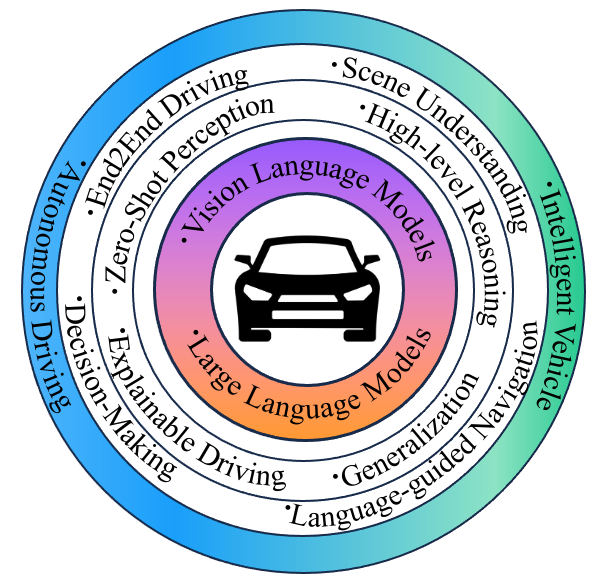

# :boom: Awesome-Vision-Language-Models (VLMs)-in-Autonomous-Driving (AD)-and-Intelligent-Transportation-Systems (ITS)
This repository collects research papers on large **Vision Language Models in Autonomous Driving and Intelligent Transportation Systems**. The repository will be continuously updated to track the latest updates. 
 
If there are any omissions or suggestions, you're warmly welcome to reach out to us (xingcheng.zhou@tum.de or mingyu.liu@tum.de). The repo is maintained by [TUM-AIR](https://www.ce.cit.tum.de/air/home/).

<p align="center">

</p>

## :fire: Citate our Paper!
Please visit [Vision Language Models in Autonomous Driving and Intelligent Transportation Systems](https://arxiv.org/pdf/2310.14414.pdf) for more details and comprehensive information. If you find our repo and paper helpful, please cite it as following.

```BibTeX
@misc{zhou2023vision,
      title={Vision Language Models in Autonomous Driving and Intelligent Transportation Systems}, 
      author={Xingcheng Zhou and Mingyu Liu and Bare Luka Zagar and Ekim Yurtsever and Alois C. Knoll},
      year={2023},
      eprint={2310.14414},
      archivePrefix={arXiv},
      primaryClass={cs.CV}
}
```

## :fire: Introduction
The applications of **Vision-Language Models (VLMs)** in the fields of **Autonomous Driving (AD)** and **Intelligent Transportation Systems (ITS)** have attracted widespread attention due to their outstanding performance and the ability to leverage **Large Language Models (LLMs)**. By integrating
language data, the vehicles, and transportation systems are able to deeply understand real-world environments, improving driving safety and efficiency

<p align="center">

</p>

## :fire: :fire: Large VLMs in Autonomous Driving

### :star: Perception and Understanding
| Method                                                                                                                                                                                                                                                                                                                                                                                                                                                                                                                                                                                                                                                                                                                       | Year | Task                                                | Code Link                                                |                                               
|:-----------------------------------------------------------------------------------------------------------------------------------------------------------------------------------------------------------------------------------------------------------------------------------------------------------------------------------------------------------------------------------------------------------------------------------------------------------------------------------------------------------------------------------------------------------------------------------------------------------------------------------------------------------------------------------------------------------------------------|------|-----------------------------------------------------|----------------------------------------------------------| 
| [The Traffic Scene Understanding and Prediction Based on Image Captioning](https://ieeexplore.ieee.org/document/9306804)                                                                                                                                                                                                                                                                                                                                                                                                                                                                                                                                                                                                     | 2020 | Image Captioning                                    |                                                          | 
| [VLPD: Context-Aware Pedestrian Detection via Vision-Language Semantic Self-Supervision](https://arxiv.org/pdf/2304.03135.pdf)                                                                                                                                                                                                                                                                                                                                                                                                                                                                                                                                                                                               | 2023 | Pedestrian Detection                                | [Github](https://github.com/lmy98129/VLPD)               | 
| [Unsupervised Multi-view Pedestrian Detection](https://arxiv.org/pdf/2305.12457.pdf)                                                                                                                                                                                                                                                                                                                                                                                                                                                                                                                                                                                                                                         | 2023 | Pedestrian Detection                                |                                                          | 
| [Language-Guided 3D Object Detection in Point Cloud for Autonomous Driving](https://arxiv.org/pdf/2305.15765.pdf)                                                                                                                                                                                                                                                                                                                                                                                                                                                                                                                                                                                                            | 2023 | Single Object Referring                             |                                                          | 
| [Referring Multi-Object Tracking](https://arxiv.org/pdf/2303.03366.pdf)                                                                                                                                                                                                                                                                                                                                                                                                                                                                                                                                                                                                                                                      | 2023 | Multiple Objects Referring and Tracking             | [Github](https://github.com/wudongming97/rmot)           | 
| [Language Prompt for Autonomous Driving](https://arxiv.org/pdf/2309.04379v1.pdf)                                                                                                                                                                                                                                                                                                                                                                                                                                                                                                                                                                                                                                             | 2023 | Multiple Objects Referring and Tracking             | [Github](https://github.com/wudongming97/prompt4driving) | 
| [OpenScene: 3D Scene Understanding with Open Vocabularies](https://arxiv.org/pdf/2211.15654.pdf)                                                                                                                                                                                                                                                                                                                                                                                                                                                                                                                                                                                                                             | 2023 | Open-Voc 3D Semantic Segmentation                   | [Github](https://github.com/pengsongyou/openscene)       |
| [CLIP2Scene: Towards Label-efficient 3D Scene Understanding by CLIP](https://arxiv.org/pdf/2301.04926.pdf)                                                                                                                                                                                                                                                                                                                                                                                                                                                                                                                                                                                                                   | 2023 | Open-Voc 3D Semantic Segmentation                   | [Github](https://github.com/runnanchen/CLIP2Scene)       | 
| [Unsupervised 3D Perception with 2D Vision-Language Distillation for Autonomous Driving](https://openaccess.thecvf.com/content/ICCV2023/papers/Najibi_Unsupervised_3D_Perception_with_2D_Vision-Language_Distillation_for_Autonomous_Driving_ICCV_2023_paper.pdf)                                                                                                                                                                                                                                                                                                                                                                                                                                                            | 2023 | Open-Voc 3D Object Detection and Tracking           |                                                          | 
| [Zelda: Video Analytics using Vision-Language Models](https://arxiv.org/pdf/2305.03785.pdf#:~:text=We%20present%20Zelda%3A%20a%20video,and%20identify%20low%2Dquality%20frames.)                                                                                                                                                                                                                                                                                                                                                                                                                                                                                                                                             | 2023 | Language-guided Video Retrieval                     |                                                          | 
| [NuScenes-QA: A Multi-modal Visual Question Answering Benchmark for Autonomous Driving Scenario](https://arxiv.org/pdf/2305.14836.pdf)                                                                                                                                                                                                                                                                                                                                                                                                                                                                                                                                                                                       | 2023 | Visual Question Answering                           | [Github](https://github.com/qiantianwen/NuScenes-QA)     | 
<<<<<<< HEAD
| [Talk2BEV: Language-Enhanced Bird's Eye View (BEV) Maps](https://arxiv.org/abs/2310.02251)                                                                                                                                                                                                                                                                                                                                                                                                                                                                                                                                                                                                                                   | 2023 | Visual Spatiel Reasoning, Open-loop Decision making | [Github](https://github.com/llmbev/talk2bev)                                              | 
| [Semantic Anomaly Detection with Large Language Models](https://arxiv.org/pdf/2305.11307.pdf)                                                                                                                                                                                                                                                                                                                                                                                                                                                                                                                                                                                                                                | 2023 | Semantic Anomaly Detection                          |                                                          |

### :star: Navigation and Planning
| Method                                                                                                                                 | Year | Task                                                    | Code Link                                              |                                               
|:---------------------------------------------------------------------------------------------------------------------------------------|------|---------------------------------------------------------|--------------------------------------------------------| 
| [Talk to the vehicle: Language conditioned autonomous navigation of self driving car](https://ieeexplore.ieee.org/document/8967929)    | 2019 | Language-Guided Navigation                              |                                                        | 
| [Ground then Navigate: Language-guided Navigation in Dynamic Scenes](https://arxiv.org/abs/2209.11972)                                 | 2022 | Language-Guided Navigation                              |                                                        |
| [ALT-Pilot: Autonomous navigation with Language augmented Topometric maps](https://arxiv.org/pdf/2310.02324.pdf)                       | 2023 | Vision-Language Localization, Language-Guided Navigation| [Page](https://navigate-anywhere.github.io/ALT-Pilot/) |
| [GPT-Driver: Learning to Drive with GPT](https://arxiv.org/pdf/2310.01415.pdf)                                                         | 2023 | Motion Planing                                          | [Github](https://github.com/PointsCoder/GPT-Driver)    |
| [Can you text what is happening? Integrating pre-trained language encoders into trajectory prediction models for autonomous driving](https://arxiv.org/pdf/2309.05282.pdf) | 2023 |Trajectory Prediction                        |                                                        |


=======
| [Talk2BEV: Language-Enhanced Bird's Eye View (BEV) Maps](https://arxiv.org/abs/2310.02251)                                                                                                                                                                                                                                                                                                                                                                                                                                                                                                                                                                                                                                   | 2023 | Visual Spatiel Reasoning, Open-loop Decision making | [Gituhub](https://github.com/llmbev/talk2bev)                                              | 
| [Semantic Anomaly Detection with Large Language Models](https://arxiv.org/pdf/2305.11307.pdf)                                                                                                                                                                                                                                                                                                                                                                                                                                                                                                                                                                                                                                | 2023 | Semantic Anomaly Detection                          |                                                          |
>>>>>>> 6d94f07107f0c0896020b0be12591bc0b3fd6994
